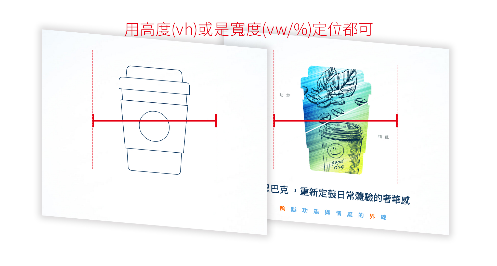
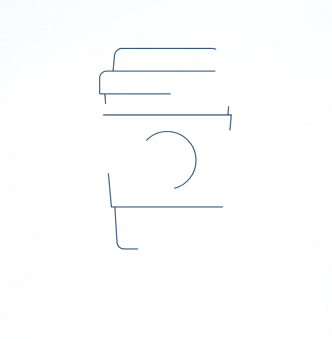
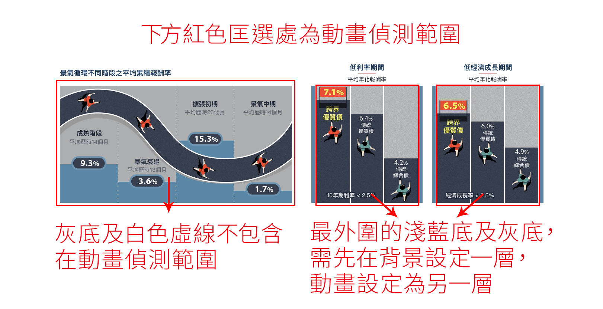

# 路博邁IPO活動網頁 動畫製程遇到的坑分享
*  [首頁](http://demo.www.zhe.tw/Alice/IPOexperienceShare-master/src/ipo/index.html) 
*  [內頁](http://demo.www.zhe.tw/Alice/IPOexperienceShare-master/src/ipo/main.html) 

## 一：看到動畫不知從何做起，讓初試者心慌慌
思考好圖層順序、定位位置及預想動畫效果後，先切版最後再加入動畫效果就對了！

   

但在一開始加入vivus.js，就遇到了一個惱人問題，動畫不會自動跑，滑鼠需要滾動，動畫才會開始。
*  [vivus.js使用方式](https://github.com/erichsupower/vivus.js-exercise) 

   

*  [錯誤範例](http://demo.www.zhe.tw/Alice/IPOexperienceShare-master/src/vivus_error/) 

其實是動畫的svg高度不可操過你的瀏覽器視窗高度，因此其實用高度(vh)來定位是最安全的。

*  [正確範例](http://demo.www.zhe.tw/Alice/IPOexperienceShare-master/src/vivus_correct/) 

另外，如果沒有設高度或是寬度，svg僅在ie顯示的大小會特別小(mac/pc，edge、safari、firefox、chrome，以上瀏覽器的大小皆同)，因此必下高度或是寬度擇一，讓svg在所有的瀏覽器裡呈現的大小一致。

*  [ie太小範例](http://demo.www.zhe.tw/Alice/IPOexperienceShare-master/src/vivus_height/) 

* * *

 
## 二：jQuery：.fadeIn();及.animate({ opacity:0 }, 秒數);的差別！

同樣都可在畫面上呈現出淡入的效果及調整淡入的時間，但實際及產生的結果還是有些微不同。

關於位置的差別：

.fadeIn()：在css來說等於display：none;的狀態，也就是一開始不存在頁面上，直到元素出現在畫面上，才佔有實際的位置。
*  [範例](http://demo.www.zhe.tw/Alice/IPOexperienceShare-master/src/IPOfadeIn/) 
  
.animate({ opacity:0 }, 秒數)：一直都存在於頁面上，只是透明度為0而已，在網頁上仍佔有實際的位置。
*  [範例](http://demo.www.zhe.tw/Alice/nb/IPO/index.html)  

關於css動畫是否要開始執行的差別：

.fadeIn()：前面說過一開始不存在頁面上，因此，當出現在頁面上之後css動畫即開始執行。
*  [範例](http://demo.www.zhe.tw/Alice/IPOexperienceShare-master/src/IPOfadeIn/) 

.animate({ opacity:0 }, 秒數)：一直都存在於頁面上，只是透明度為0而已，因此，雖然未顯示在頁面上但css動畫其實已開始執行。
*  [範例](http://demo.www.zhe.tw/Alice/IPOexperienceShare-master/src/IPOtextOpacity/) 

* * *

## 三：Wow.js 偵測動畫套件

*  [wow.js使用方式](https://github.com/aliceyen/animateShare) 

此次製作動畫主要是採用wow.js來偵測動畫的開始，但動畫製作完後，部分區域的元素會有蹦出來的問題。

*  [問題範例](http://demo.www.zhe.tw/Alice/IPOexperienceShare-master/src/IPOpopOut/main.html) 

原因是因為動畫偵測範圍設定過大，偵測範圍建議避開須常駐在畫面上的元素（無動畫元素），即可解決。

*  [修正範例](http://demo.www.zhe.tw/Alice/IPOexperienceShare-master/src/ipo/main.html) 

   

* * *

## 四：rellax.js 滾動視差套件

此套件使用很簡單，但詳細使用方式，後續或許艾哥會分享，因此我這邊暫不描述，直接進入我遇到的問題及解法給大家參考！

*  [rellax.js官方網站](https://dixonandmoe.com/rellax/) 

主要遇到的問題為以下：

網頁重整後，畫面裡的方塊位置都會跑版，和原來css設定的位置不同。

雖然在正常使用上並不會有一直重整的問題（強迫症），但設計師調整完讓另一位使用者觀看網頁時（第一次開啟），網頁上有視差滾動效果的裝飾常常不在設計師設定的位置上，且原套件官網並無此問題，因此希望解決bug。

*  [跑版範例](http://demo.www.zhe.tw/Alice/IPOexperienceShare-master/src/IPOrellax/main.html) 
  
在RWD網頁切版中，設計師較常使用width:100%，而之中元素的高度因寬度的變大(變小)而自動撐高(縮短)網頁內容。

但在使用rellax.js視差滾動套件時，若上方元素含有定位及複雜的js動畫，建議元素使用height:%或是vh，預先幫網頁撐好高度，有了固定的高度，下方的視差滾動跑位問題即解決。

*  [正常範例](http://demo.www.zhe.tw/Alice/IPOexperienceShare-master/src/ipo/main.html) 
